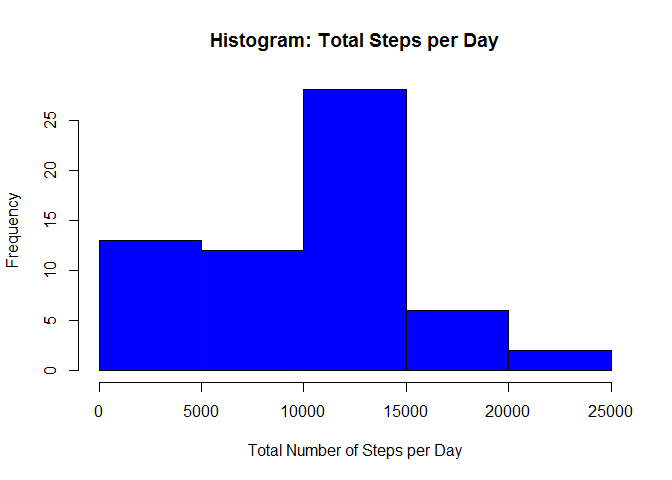
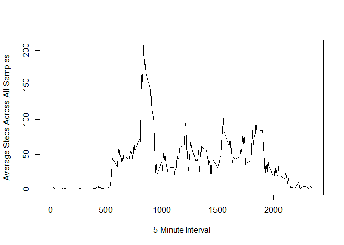
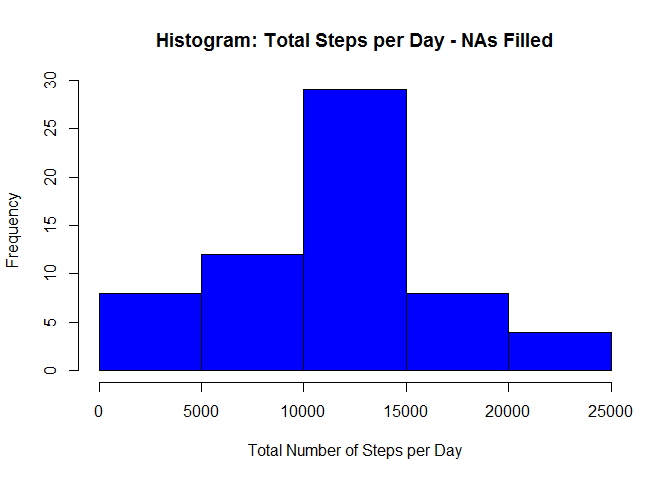
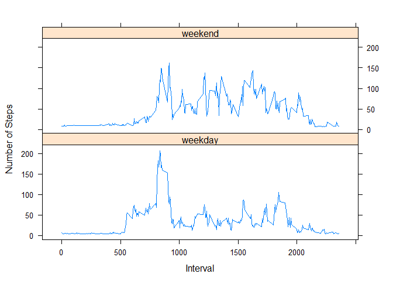

# Reproducible Research: Peer Assessment 1


## Loading and preprocessing the data


```r
unzip(zipfile="activity.zip")
activityData <- read.csv("activity.csv")
```

## What is mean total number of steps taken per day?
### Produce histogram of the total number of steps taken per day

```r
totalStepsPerDay <- tapply(activityData$steps, activityData$date, sum, na.rm=TRUE)
hist(totalStepsPerDay,main="Histogram: Total Steps per Day",xlab="Total Number of Steps per Day",ylab="Frequency",col='blue')
```

 

### Calculate and report the mean and median total number of steps taken per day

```r
meanStepsPerDay <- mean(totalStepsPerDay, na.rm=TRUE)
medianStepsPerDay <- median(totalStepsPerDay, na.rm=TRUE)
```
The mean number of steps taken per day is 9354.2295082. 
The median number of steps taken per day is 10395.

## What is the average daily activity pattern?
### Make a time series plot (i.e. type = "l") of the 5-minute interval (x-axis) and the average number of steps taken, averaged across all days (y-axis)

```r
averageStepsPerInterval <- aggregate(x=list(steps=activityData$steps),
                                     by=list(interval=activityData$interval),
                                     FUN=mean, na.rm=TRUE)
plot(averageStepsPerInterval,type="l",xlab="5-Minute Interval",ylab="Average Steps Across All Samples")
```

 

### Which 5-minute interval, on average across all the days in the dataset, contains the maximum number of steps?

```r
intervalMaxAverageSteps <- averageStepsPerInterval[max(averageStepsPerInterval$steps),1]
```
The 5-minute interval containing maximum average number of steps taken is 1705.


## Imputing missing values
Note that there are a number of days/intervals where there are missing values (coded as NA). The presence of missing days may introduce bias into some calculations or summaries of the data.

### Calculate and report the total number of missing values in the dataset (i.e. the total number of rows with NAs)

```r
totalNAs <- sum(is.na(activityData$steps))
```
The total number of missing values in the dataset is 2304.


### Devise a strategy for filling in all of the missing values in the dataset. The strategy does not need to be sophisticated. For example, you could use the mean/median for that day, or the mean for that 5-minute interval, etc.

```r
# Approach is to fill missing values with average for time interval
activitiesWithIntervalMean <- merge(activityData,averageStepsPerInterval,by.x='interval',by.y='interval')
```

### Create a new dataset that is equal to the original dataset but with the missing data filled in.

```r
# Clone existing data frame
activityDataNAFilled <- activityData

# Loop through new data set and fill NAs with interval mean where NA is present
for(i in 1:dim(activityDataNAFilled)[1])
    {
    if(is.na(activityDataNAFilled[i,1])) 
        activityDataNAFilled[i,1]<-activitiesWithIntervalMean[i,4]
    }
```

### Make a histogram of the total number of steps taken each day and Calculate and report the mean and median total number of steps taken per day. Do these values differ from the estimates from the first part of the assignment? What is the impact of imputing missing data on the estimates of the total daily number of steps?

```r
totalStepsPerDay <- tapply(activityDataNAFilled$steps, activityDataNAFilled$date, sum, na.rm=TRUE)
hist(totalStepsPerDay,main="Histogram: Total Steps per Day - NAs Filled",xlab="Total Number of Steps per Day",ylab="Frequency",col='blue')
```

 

### Calculate and report the mean and median total number of steps taken per day with imputed values

```r
meanStepsPerDayNAs <- mean(totalStepsPerDay, na.rm=TRUE)
medianStepsPerDayNAs <- median(totalStepsPerDay, na.rm=TRUE)

meanStepsDifference <- meanStepsPerDayNAs - meanStepsPerDay
medianStepsDifference <- medianStepsPerDayNAs - medianStepsPerDay
```
The mean number of steps taken per day is 1.0889799\times 10^{4}, a difference of 1535.5697495 from the original calculated value. 
The median number of steps taken per day is 1.1015\times 10^{4}, a difference of 620 from the original calculated value.


## Are there differences in activity patterns between weekdays and weekends?
### Create a new factor variable in the dataset with two levels - "weekday" and "weekend" indicating whether a given date is a weekday or weekend day.

```r
# Create vector to hold week days
weekDays <- c('Monday', 'Tuesday', 'Wednesday', 'Thursday', 'Friday')

# Define function to return weekday or weekend for a provided date
weekdayOrWeekend <- function(date) {
    dayName <- weekdays(date)
    if (dayName %in% weekDays)
        return("weekday")
    else
        return("weekend")
}

# Add weekday or weekend identifier to data frame
activityDataNAFilled$date <- as.Date(activityDataNAFilled$date)
activityDataNAFilled$dayType <- sapply(activityDataNAFilled$date, FUN=weekdayOrWeekend)
```

### Make a panel plot containing a time series plot (i.e. type = "l") of the 5-minute interval (x-axis) and the average number of steps taken, averaged across all weekday days or weekend days (y-axis). See the README file in the GitHub repository to see an example of what this plot should look like using simulated data.

```r
averageStepsPerInterval <- aggregate(activityDataNAFilled$steps, 
                      list(interval = as.numeric(as.character(activityDataNAFilled$interval)), 
                           dayType = activityDataNAFilled$dayType),
                      FUN = "mean")
names(averageStepsPerInterval)[3] <- "meanOfIntervalSteps"
library(lattice)
xyplot(averageStepsPerInterval$meanOfIntervalSteps ~ averageStepsPerInterval$interval | averageStepsPerInterval$dayType, 
       layout = c(1, 2), type = "l", 
       xlab = "Interval", ylab = "Number of Steps")
```

 
